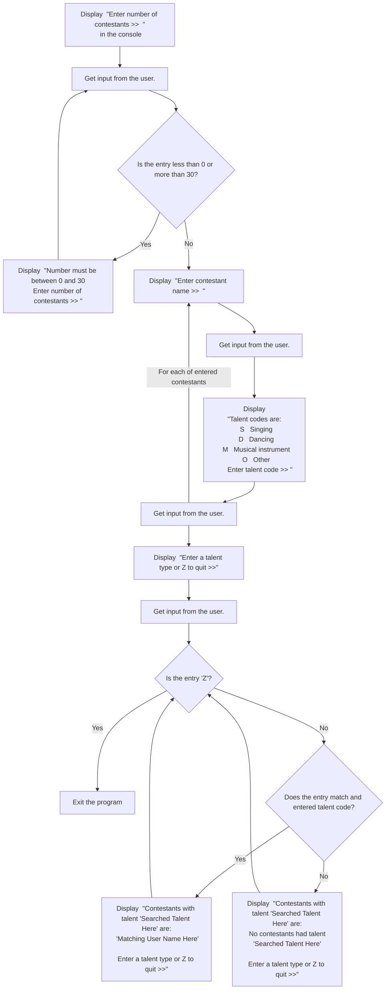

# BIS 305 Assignment 7B - Case Problem 9-1.

This repo is for use to code and debug the BIS 305 Assignment 7B - Case Problem 9-1.

### Use Case 1

The inputs in the console could be like:

```html
Enter number of contestants >> 3
Enter contestant name >> Jill
```

The output from the console with the next input should be:

```html
Talent codes are:
  S   Singing
  D   Dancing
  M   Musical instrument    
  O   Other
       Enter talent code >> S
Enter contestant name >> Mikia       
```

The output from the console with the next input should be:

```html
Talent codes are:
  S   Singing
  D   Dancing
  M   Musical instrument
  O   Other
       Enter talent code >> M
Enter contestant name >> Sarah       
```

The output from the console with the next input should be:

```html
Talent codes are:
  S   Singing
  D   Dancing
  M   Musical instrument
  O   Other
       Enter talent code >> D
```

The output from the console with the next input should be:

```html
The types of talent are:
S     Singing
D     Dancing
M     Musical instrument
O     Other

Enter a talent type or Z to quit >> S
```

The output from the console with the next input should be:

```html
Contestants with talent Singing are:
Jill

Enter a talent type or Z to quit >> D
```

The output from the console with the next input should be:

```html
Contestants with talent Dancing are:
Sarah

Enter a talent type or Z to quit >> M
```

The output from the console with the next input should be:

```html
Contestants with talent Musical instrument are:
Mikia

Enter a talent type or Z to quit >> O
```

The output from the console with the next input should be:

```html
Contestants with talent Other are:
No contestants had talent Other

Enter a talent type or Z to quit >> Z
```

Given your entry of Z to quit, your program should then exit.

**NOTE** that in order to pass this repo's tests, in addition to MindTap, to prepend the $ to currency values, use the `CultureInfo.GetCultureInfo` method. In order to do this, include the statement `using System.Globalization;` at the top of your program and format the output statements as follows: 

```csharp
  WriteLine("This is an example: {0}", value.ToString("C", CultureInfo.GetCultureInfo("en-US")));
```

### Here is a flowchart for the logic:  
<!-- below from https://github.com/mermaid-js/mermaid -->

